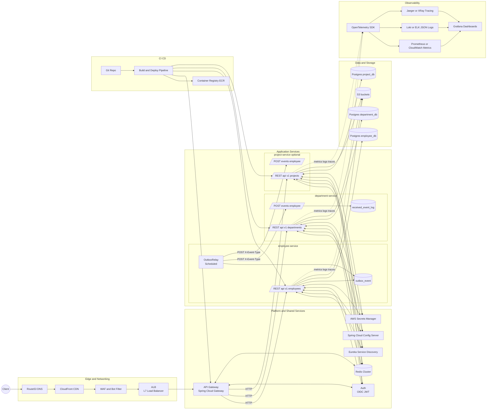

# Spring Boot 3.0 Microservices (Java 17)

A realistic microservices starter with:

- **Discovery**: Eureka server (`discovery-service`)
- **API Gateway**: Spring Cloud Gateway (`api-gateway`)
- **Services**: Employee + Department (each with Postgres + Flyway)
- **DB**: Postgres connection is shared, with **separate schemas** per service
- **Migrations**: Flyway (`classpath:/db/migration`)
- **Centralized config**: Spring Cloud Config Server (config-server) + config-repo folder
- **Project-service**: Projects & Members
- **Docs**: OpenAPI/Swagger UI per service
- **Error model**: Global ProblemDetail responses
- **Tests**: Unit, WebMvc slice, and SpringBootTest without DB

## Prerequisites

- Java 21
- Maven 3.8+
- Postgres running locally and accessible at (you can set it up by yourself):
  - `jdbc:postgresql://localhost:5432/postgres`
  - username: `postgres`
  - password: `pppp`

> Adjust credentials in each service's `application.yml` if yours differ.

## Order to Run (separate terminals)

```bash
# 1) Start discovery
mvn -pl discovery-service spring-boot:run

# 2) Start gateway
mvn -pl api-gateway spring-boot:run

# 3) Start services (can be in any order after discovery is up)
mvn -pl department-service spring-boot:run
mvn -pl employee-service spring-boot:run
mvn -pl project-service spring-boot:run
```

Eureka dashboard: http://localhost:8761

Gateway will expose routes:

- `GET http://localhost:8080/departments` (rewritten to `DEPARTMENT-SERVICE /api/v1/departments`)
- `GET http://localhost:8080/employees` (rewritten to `EMPLOYEE-SERVICE /api/v1/employees`)

OpenAPI UIs (service level):

- Employee: http://localhost:8081/swagger-ui.html
- Department: http://localhost:8082/swagger-ui.html
- Project: http://localhost:8084/swagger-ui/index.html

## Notes

- Each service uses **Flyway** and its own schema (`employee`, `department`) with separate history tables.
- The `employee-service` uses **OpenFeign** to enrich employees with department details.
- Health endpoints: `/actuator/health`
- Default ports:
  - Discovery: 8761
  - Gateway: 8080
  - Employee: 8081
  - Department: 8082
  - Project: 8084
- After you start the services, please make sure you are able to execute the following code:
  - Employees Service
    - curl -s http://localhost:8080/employees
    - curl -s http://localhost:8080/employees/1
    - curl -s -X POST http://localhost:8080/employees \
      -H "Content-Type: application/json" \
      -d '{ "firstName": "Dina", "lastName": "Khan", "email": "dina@example.com", "departmentId": 1 }'
  - Department Service
    - curl -s http://localhost:8080/departments
    - curl -s http://localhost:8080/departments/1
    - curl -s -X POST http://localhost:8080/departments/ \
      -H "Content-Type: application/json" \
      -d '{ "name": "Finance", "description": "Money things" }'

## Additional Requirements Implemented

### 1. Event-Driven Communication (Outbox Pattern)
To decouple services and support asynchronous notifications, we introduced an **Outbox pattern**.
- **Employee Service** now publishes integration events (`employee.created.v1`, `employee.updated.v1`, `employee.deleted.v1`) into an `outbox_event` table within the same transaction as business changes.
- A background relay (`OutboxRelay`) reliably delivers these events to subscribers (`Department Service`, `Project Service`) via HTTP. Failed deliveries are retried with exponential backoff until successful.
- **Department Service** and **Project Service** each expose a lightweight endpoint (`/events/employee`) to consume events, ensuring eventual consistency without tight coupling.

This ensures that cross-service communication is **reliable, decoupled, and retryable**, even without Kafka or a message broker.

---

### 2. Resilience and Fault Tolerance
To improve fault tolerance when one service depends on another (e.g., `Employee Service` calling `Department Service`), we integrated **Resilience4j** with:
- **Circuit Breaker**: Prevents cascading failures by opening after repeated downstream errors, and recovering gracefully.
- **Retry**: Automatically retries transient failures with a backoff policy.
- **Fallbacks**: When retries/circuit breaker fail, the service returns a safe fallback (e.g., Employee data without department details) instead of propagating errors.

We also enabled **Actuator + Micrometer metrics** to monitor circuit breaker states, retry counts, and resilience performance at runtime.

---

These improvements make the system:
- **More reliable** under network issues or service outages.
- **More scalable** by supporting asynchronous communication between services.
- **More observable** with resilience metrics exposed via `/actuator`.


## System Architecture:
This project enhances the base microservices with event-driven communication (Outbox + Webhooks) and introduces several supporting services to make the system scalable, secure, and observable.

🔹 What We Added, Where, and Why

### Application Load Balancer (ALB)
Where: In front of the API Gateway.
Why: Provides TLS termination, health checks, scaling, and supports zero-downtime deployments (blue/green, canary).

### API Gateway (Spring Cloud Gateway)
Where: Entry point to all services.
Why: Centralizes routing, enforces authentication, rate limits, and propagates trace headers.

### Authentication & Authorization (OIDC/JWT via Keycloak or AWS Cognito)
Where: Gateway and services.
Why: Blocks unauthenticated requests at the edge, enables role/claim-based access control, and enforces least privilege.

### Service Discovery (Eureka)
Where: All microservices and the gateway.
Why: Enables service-to-service calls by logical name, resilient to scaling and instance churn.

### Config Server
Where: Shared platform layer.
Why: Centralized configuration with environment profiles and version control, simplifying deployments and rollbacks.

### Redis
Where: Shared infra, used by gateway and services.
Why: Provides fast caching (e.g., department lookups), gateway rate limiting, and idempotency key storage.

### AWS S3
Where: Used by services.
Why: Reliable storage for backups, file attachments, and data exports; can also archive outbox events.

### Observability (OpenTelemetry, Prometheus, ELK/Loki, Jaeger/Grafana)
Where: All services.
Why: Collects metrics, logs, and traces for debugging, performance monitoring, and SLO enforcement.

### Secrets Manager
Where: Platform layer.
Why: Stores secrets outside of code, supports rotation, and avoids hardcoding credentials in Git.

### CI/CD Pipeline (GitHub Actions / GitLab + ECR)
Where: DevOps pipeline.
Why: Automated build, test, containerization, and deployment with repeatability and rollback support.

🔹 Benefits

* **Decoupling & Eventual Consistency:**  Outbox + relay allows async updates without direct service coupling.

* **Security & Governance:** Central auth, secure secrets, and audited configs.

* **Resilience:** Service discovery, retries, circuit breakers, caching.

* **Scalability:** Load balancer + gateway scaling horizontally.

* **Observability:** Metrics, logs, and traces make issues visible early.

* **Operational Excellence:** CI/CD, config server, and monitoring shorten feedback loops.



